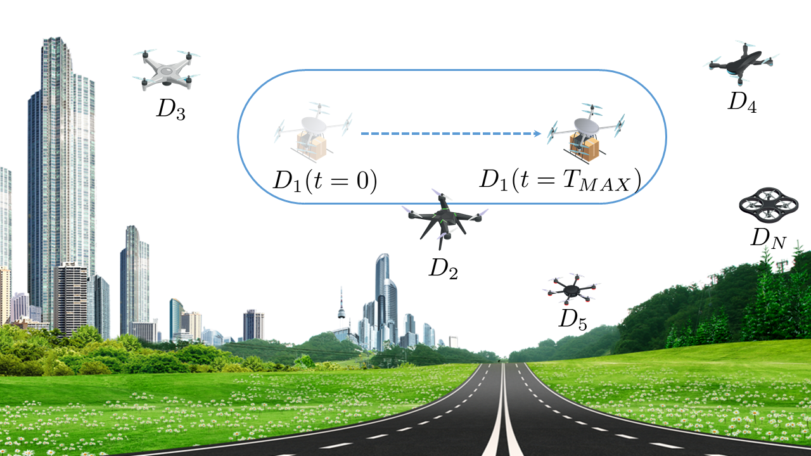

## PPCA: Privacy-Preserving Collision Avoidance for Autonomous Unmanned Aerial Vehicles
`PPCA` is a lightweight, distributed, and privacy-preserving privacy-preserving <b>collision avoidance</b> scheme for autonomous UAVs. It integrates and turns privacy-preserving proximity testing solutions, traditionally adopted in online geo-social networks, into a real-time interactive approach to detect co-location among moving entities, and to avoid approaching collisions.

     

The details will be provided in the paper.

## Demo Video

## Formal verification with ProVerif
The security properties of `PPCA` have been verified formally and experimentally by using the open-source tool <a href="https://prosecco.gforge.inria.fr/personal/bblanche/proverif/">ProVerif 2.01</a>, demonstrating enhanced security protection with respect to state-of-the-art approaches.

In order to test the security properties, download the file <a href="ppca.pv">ppca.pv</a> and run: `./proverif ppca.pv | grep "RESULT"`.
Further, in order to verify that the location is a strong secret (i.e. the attacker cannot launch offline guessing attacks on the location value), please follow the guidelines inside the code.

  

## Contributing
Pull requests are welcome. For major changes, please open an issue first to discuss what you would like to change.

## Developers
- Pietro Tedeschi        (<ptedeschi@hbku.edu.qa>) 
- Savio Sciancalepore    (<ssciancalepore@hbku.edu.qa>) 
- Roberto Di Pietro      (<rdipietro@hbku.edu.qa>) 
Division of Information and Computing Technology (ICT), College of Science and Engineering (CSE) Hamad Bin Khalifa University (HBKU), Doha, Qatar 

## License
`PPCA` is released under the GNU General Public License v3.0 <a href="LICENSE">license</a>.
